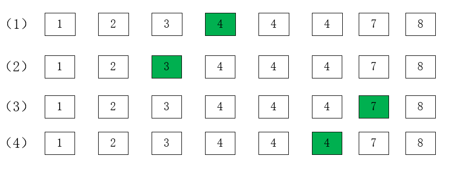

# The-most-robust-binary-search

Recently, when working with data series information, I needed to find the corresponding data and used the dichotomous lookup method. In the use of the While loop has been caught in the difficult to adjust the reference, so in-depth dichotomous find the principle of the following rules.
## Examples
As a simple example, let an array be {1,2,3,4,4,4,7,8}.
One needs to find the requirements.
-  1、Find the first ">=4" element.
-  2、Find the last "<4" element.
-  3、Find the first ">4" element.
-  4、Find the last "<=4" element.

The following graph shows the corresponding numbers.
<div align=center></div>

## Pseudo-code

```
l=-1, r=N
while l+1 != r
   m=(l+r)/2
   if IsBlue(m)  //IsBlue stands for condition
       l=m
    else
       r=m
return l or r
```

## Steps

- 1. modeling: divide the blue and red areas, determine IsBlue ()
- 2. determine whether to return L or R
- 3. apply the algorithm template

## Example Question 1


