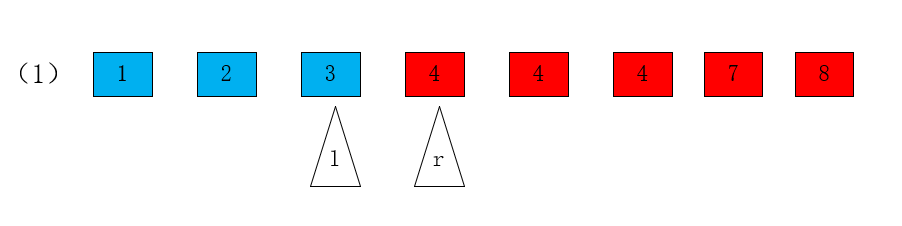

# The-most-robust-binary-search

Recently, when working with data series information, I needed to find the corresponding data and used the dichotomous lookup method. In the use of the While loop has been caught in the difficult to adjust the reference, so in-depth dichotomous find the principle of the following rules.
## Examples
As a simple example, let an array be {1,2,3,4,4,4,7,8}.
One needs to find the requirements.
-  1、Find the first ">=4" element.
-  2、Find the last "<4" element.
-  3、Find the first ">4" element.
-  4、Find the last "<=4" element.

The following graph shows the corresponding numbers.
<div align=center></div>

## Pseudo-code

```
l=-1, r=N
while l+1 != r
   m=(l+r)/2
   if IsBlue(m)  //IsBlue stands for condition
       l=m
   else
       r=m
return l or r
```

## Steps

- 1. modeling: divide the blue and red areas, determine IsBlue ()
- 2. determine whether to return L or R
- 3. apply the algorithm template

## Example Question 1

- 1、Dividing red and blue areas according to the problem.
<div align=center></div>

- 2. From the graph, we get (">=4") by returning r.
- 3. Applying pseudo-algorithms.

The remaining questions are similar to question 1.

## Details

- Time Complexity.
    The time complexity is O(logn). This is because half the length of the data is taken in each loop, so we need more than logn times to reduce the length of the array to 0.
    
- Why is the initial value of l -1 and the initial value of r N?

      Assuming that the array is initially all red, it will cause an error if l=0.
      Similarly, assuming that the array is initially all blue, an error will be caused if r=n-1.
      
- whether m is within [0,N) ?

     m_min= ? 
     
     l_min=-1
     
     r_min=1
     
     so, m_min=0
     
     m_max= ?
     
     l_max= N-2
     
     r_max=N
     
     so, m_max=n-1
     
- Is it caught in a dead-end cycle?
  
  For (l+1=r), the next element of l is r. The loop exits immediately.
  
         l+1=r
         
  For (l+2=r), the intermediate element m between l and r can be calculated, so either l=m,or r=m will also exit the loop.
  
         l+2=r
         
   The third case either returns to the second case or the first case.
   
         l+3=r
         
     
     


